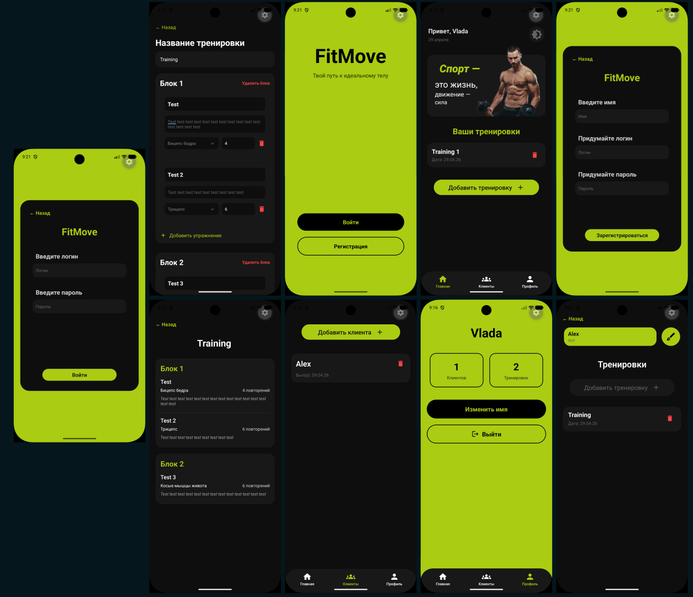

# FITMOVE - Fitness App

## 🚀 Quick Start

### 1. Clone Repository
```bash
git clone <repository-url>
cd FITMOVE
```

### 2. Install Backend Dependencies
```bash
cd backend
python -m venv .venv
source .venv/bin/activate  # Windows: .venv\Scripts\activate
pip install -r requirements.txt
cd ..
```

### 3. Install Frontend Dependencies
```bash
cd frontend
npm install
cd ..
```

### 4. Start Backend (Docker)
```bash
cd backend
docker-compose up --build
# Backend will run at http://localhost:8000
```

### 5. Start Frontend in Android Studio
```bash
# Open Android Studio, create an Android emulator
# Then run:
cd frontend
npx expo start --android
```

## 📋 Requirements
- Python 3.9+
- Node.js 18+
- Docker & Docker Compose
- Android Studio

## 📦 Main Commands
```bash
# Backend without Docker
cd backend && uvicorn app.main:app --reload

# Build APK
cd frontend && npx expo prebuild --clean && cd android && ./gradlew assembleDebug

# Clear cache
cd frontend && npx expo start -c
```

## 🔧 Troubleshooting
```bash
# SDK not found
export ANDROID_HOME=$HOME/Android/Sdk

# Port busy
lsof -i :8000 && kill -9 <PID>
```

---

## Done! App is running 💪
<p align="center">
  
</p>

